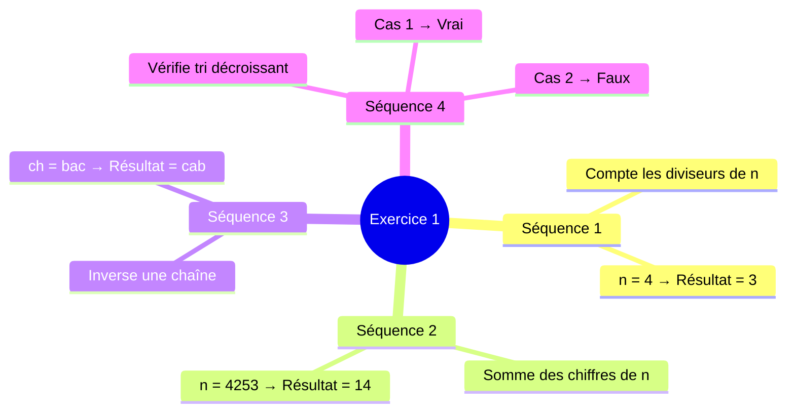
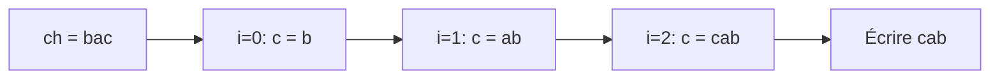
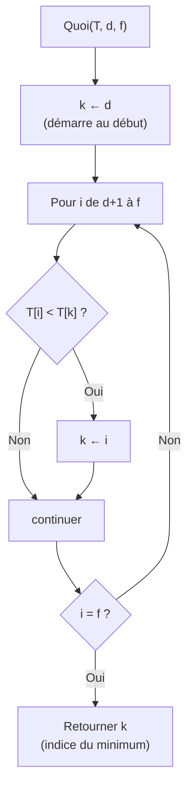
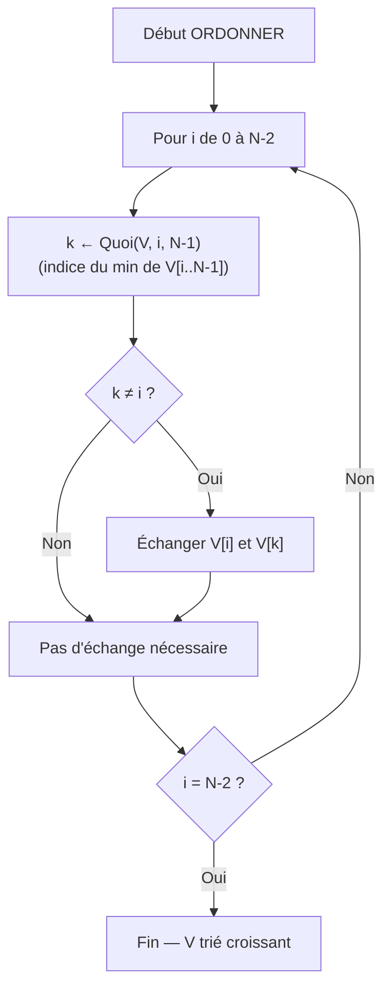
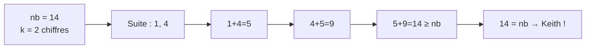
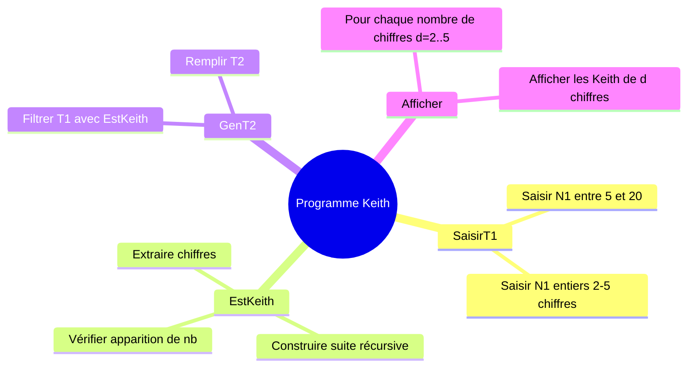
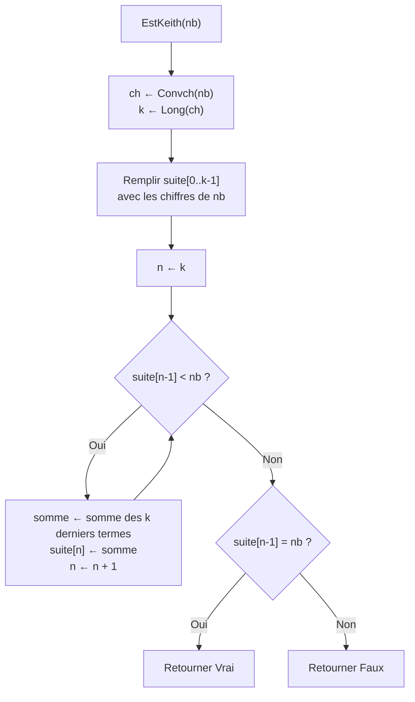

# BAC I — Correction Complète (Session 2025)
> Informatique Théorique · Sections : Maths, Sciences Exp., Sciences Tech.

---

## Exercice 1 (3,25 points) — Traces d'exécution

### Vue d'ensemble — Séquences algorithmiques



---

### Séquence 1 — Comptage des diviseurs (`n = 4`)

```
x ← 0
Pour i de 1 à n Faire
  Si (n Mod i = 0) Alors
    x ← x + 1
  FinSi
Fin Pour
Ecrire (x)
```

**Trace détaillée :**

| i | n Mod i | Condition | x |
|---|---------|-----------|---|
| 1 | 4 Mod 1 = **0** | Vraie | 1 |
| 2 | 4 Mod 2 = **0** | Vraie | 2 |
| 3 | 4 Mod 3 = **1** | Fausse | 2 |
| 4 | 4 Mod 4 = **0** | Vraie | 3 |

**Résultat :** `3`

**Rôle :** Compter le nombre de diviseurs de `n`.

---

### Séquence 2 — Somme des chiffres (`n = 4253`)

```
s ← 0
ch ← Convch(n)         -- ch = "4253"
Pour i de Long(ch)-1 à 0 (Pas=-1) Faire
  s ← s + Valeur(ch[i])
Fin Pour
Ecrire(s)
```

**Trace détaillée :**

`ch = "4253"`, `Long(ch) = 4`, i va de **3** à **0**

| i | ch[i] | Valeur(ch[i]) | s |
|---|-------|---------------|---|
| 3 | "3"   | 3             | 3 |
| 2 | "5"   | 5             | 8 |
| 1 | "2"   | 2             | 10 |
| 0 | "4"   | 4             | 14 |

**Résultat :** `14`

**Rôle :** Calculer la somme des chiffres de `n`.

> **Piège :** La boucle va de droite à gauche (Pas = -1) mais la somme est la même dans les deux sens.

---

### Séquence 3 — Inversion de chaîne (`ch = "bac"`)

```
c ← ""
Pour i de 0 à Long(ch)-1 Faire
  c ← ch[i] + c
Fin Pour
Ecrire(c)
```

**Trace détaillée :**

`Long(ch) = 3`, i va de **0** à **2**

| i | ch[i] | c (avant) | c = ch[i] + c |
|---|-------|-----------|----------------|
| 0 | "b"   | ""        | "b" + "" = **"b"** |
| 1 | "a"   | "b"       | "a" + "b" = **"ab"** |
| 2 | "c"   | "ab"      | "c" + "ab" = **"cab"** |

**Résultat :** `"cab"`

**Rôle :** Inverser la chaîne de caractères `ch`.



---

### Séquence 4 — Vérification tri décroissant

```
i ← 1
Tant que (i < n) et (T[i-1] >= T[i]) Faire
  i ← i + 1
Fin Tant que
Ecrire (i = n)
```

**Rôle :** Vérifier si le tableau T est trié en ordre **non-croissant** (décroissant).

**Cas 1 : n=5, T = [25, 20, 17, 12, 9]**

| i | Condition | T[i-1] | T[i] | T[i-1] >= T[i] |
|---|-----------|--------|------|-----------------|
| 1 | 1 < 5 ✓   | 25     | 20   | ✓ → i=2 |
| 2 | 2 < 5 ✓   | 20     | 17   | ✓ → i=3 |
| 3 | 3 < 5 ✓   | 17     | 12   | ✓ → i=4 |
| 4 | 4 < 5 ✓   | 12     | 9    | ✓ → i=5 |
| 5 | 5 < 5 ✗   | —      | —    | Arrêt |

`i = n` → `5 = 5` → **Vrai**

**Cas 2 : n=5, T = [25, 9, 12, 20, 17]**

| i | Condition | T[i-1] | T[i] | T[i-1] >= T[i] |
|---|-----------|--------|------|-----------------|
| 1 | 1 < 5 ✓   | 25     | 9    | ✓ → i=2 |
| 2 | 2 < 5 ✓   | 9      | 12   | ✗ → Arrêt |

`i = n` → `2 = 5` → **Faux**

---

## Exercice 2 (3,75 points) — Fonction Quoi

### Algorithme analysé

```
Fonction Quoi (T : TAB, d, f : Entier) : ???
DEBUT
  k ← d
  Pour i de d+1 à f Faire
    Si T[i] < T[k] Alors
      k ← i
    FinSi
  Fin Pour
  Retourner k
FIN
```

### 1) Type retourné

La fonction retourne `k`, qui est un **indice** (position dans le tableau).

**Type retourné : Entier**

### 2a) Tableau T (10 éléments)

| Indice | 0   | 1  | 2  | 3   | 4 | 5  | 6  | 7  | 8 | 9  |
|--------|-----|----|----|-----|---|----|----|----|---|----|
| Valeur | 112 | 54 | 59 | -15 | 1 | -5 | 29 | 17 | 0 | 47 |

**Quoi(T, 4, 8) :**
- k=4 (T[4]=1), i parcourt 5..8
  - i=5 : T[5]=-5 < T[4]=1 → **k=5**
  - i=6 : T[6]=29 < T[5]=-5 ? Non
  - i=7 : T[7]=17 < T[5]=-5 ? Non
  - i=8 : T[8]=0 < T[5]=-5 ? Non
- **Résultat = 5**

**Quoi(T, 6, 9) :**
- k=6 (T[6]=29), i parcourt 7..9
  - i=7 : T[7]=17 < T[6]=29 → **k=7**
  - i=8 : T[8]=0 < T[7]=17 → **k=8**
  - i=9 : T[9]=47 < T[8]=0 ? Non
- **Résultat = 8**

**Quoi(T, 0, 9) :**
- k=0 (T[0]=112), i parcourt 1..9
  - i=1 : T[1]=54 < 112 → k=1
  - i=2 : T[2]=59 < 54 ? Non
  - i=3 : T[3]=-15 < 54 → **k=3**
  - i=4..9 : tous > -15 → pas de changement
- **Résultat = 3**



### 2b) Rôle de la fonction Quoi

**Rôle :** La fonction Quoi retourne l'**indice** de l'élément le plus petit dans la tranche `[d..f]` du tableau `T`.

### 3) Module ORDONNER (Tri par sélection)

```
Module ORDONNER (V : TAB, N : Entier)
Objet   Type/Nature
Temp    Entier
k       Entier

DEBUT
  Pour i de 0 à N-2 Faire
    k ← Quoi(V, i, N-1)
    Si k ≠ i Alors
      Temp ← V[i]
      V[i] ← V[k]
      V[k] ← Temp
    FinSi
  Fin Pour
FIN
```



**Principe :** À chaque itération `i`, on place le minimum de `V[i..N-1]` à la position `i`.

---

## Problème (13 points) — Nombres de Keith

### Rappel du concept



**Règle générale :**
1. Extraire les k chiffres → premiers termes de la suite
2. Terme suivant = somme des k derniers termes
3. Arrêt quand dernier terme ≥ nb
4. Si dernier terme = nb → nombre de Keith

---

### Décomposition en modules



---

### Déclaration des types et objets globaux

```
Nouveau type :
TAB = Tableau de 20 Entier
SUITE = Tableau de 200 Entier

Objet   Type/Nature
T1      TAB
T2      TAB
N1      Entier
N2      Entier
```

---

### Programme principal

```
ALGORITHME Keith
Objet   Type/Nature
T1, T2  TAB
N1, N2  Entier

DEBUT
  SaisirT1(T1, N1)
  GenT2(T1, N1, T2, N2)
  Afficher(T2, N2)
FIN
```

---

### Module SaisirT1

```
Module SaisirT1 (var T1 : TAB, var N1 : Entier)
Objet   Type/Nature
i       Entier

DEBUT
  Répéter
    Ecrire("Donner N1 (5 ≤ N1 ≤ 20) : ")
    Lire(N1)
  Jusqu'à (N1 >= 5) et (N1 <= 20)

  Pour i de 0 à N1-1 Faire
    Répéter
      Ecrire("T1[", i, "] = ")
      Lire(T1[i])
    Jusqu'à (T1[i] >= 10) et (T1[i] <= 99999)
  Fin Pour
FIN
```

> **Piège :** Les bornes sont **≥ 10** (2 chiffres min) et **≤ 99999** (5 chiffres max).

---

### Fonction EstKeith



```
Fonction EstKeith (nb : Entier) : Booléen
Objet         Type/Nature
ch            Chaîne de caractères
k, i, j, n   Entier
somme         Entier
suite         SUITE

DEBUT
  ch ← Convch(nb)
  k  ← Long(ch)

  Pour i de 0 à k-1 Faire
    suite[i] ← Valeur(ch[i])
  Fin Pour

  n ← k
  Tant que suite[n-1] < nb Faire
    somme ← 0
    Pour j de n-k à n-1 Faire
      somme ← somme + suite[j]
    Fin Pour
    suite[n] ← somme
    n ← n + 1
  Fin Tant que

  Retourner (suite[n-1] = nb)
FIN
```

**Exemple de trace pour nb=14 :**

| n | suite | Condition suite[n-1] < 14 |
|---|-------|--------------------------|
| 2 | [1,4,…] | suite[1]=4 < 14 ✓ |
| 3 | [1,4,5,…] | suite[2]=5 < 14 ✓ |
| 4 | [1,4,5,9,…] | suite[3]=9 < 14 ✓ |
| 5 | [1,4,5,9,14] | suite[4]=14 < 14 ✗ → Arrêt |

suite[4] = 14 = nb → **Retourner Vrai**

---

### Module GenT2

```
Module GenT2 (T1 : TAB, N1 : Entier, var T2 : TAB, var N2 : Entier)
Objet   Type/Nature
i       Entier

DEBUT
  N2 ← 0
  Pour i de 0 à N1-1 Faire
    Si EstKeith(T1[i]) Alors
      T2[N2] ← T1[i]
      N2 ← N2 + 1
    FinSi
  Fin Pour
FIN
```

---

### Module Afficher

```
Module Afficher (T2 : TAB, N2 : Entier)
Objet          Type/Nature
d, j, trouve   Entier
ch             Chaîne de caractères

DEBUT
  Pour d de 2 à 5 Faire
    trouve ← 0
    ch ← ""
    Pour j de 0 à N2-1 Faire
      Si Long(Convch(T2[j])) = d Alors
        Si trouve = 0 Alors
          ch ← Convch(T2[j])
        Sinon
          ch ← ch + ", " + Convch(T2[j])
        FinSi
        trouve ← trouve + 1
      FinSi
    Fin Pour
    Si trouve = 0 Alors
      Ecrire("Aucun nombre de Keith de ", d, " chiffres.")
    Sinon
      Ecrire(ch, " : nombre(s) de Keith de ", d, " chiffres.")
    FinSi
  Fin Pour
FIN
```

---

### Vérification avec l'exemple du sujet

Pour T1 = [31331, 189, 14, 1537, 918, 34705, 4788, 61, 55604, 713, 47, 34285]

T2 après filtrage = [31331, 14, 1537, 4788, 61, 55604, 47, 34285]

| d | Nombres dans T2 ayant d chiffres | Affichage |
|---|----------------------------------|-----------|
| 2 | 14, 61, 47 | `14, 61, 47 : nombre(s) de Keith de 2 chiffres.` |
| 3 | aucun | `Aucun nombre de Keith de 3 chiffres.` |
| 4 | 1537, 4788 | `1537, 4788 : nombre(s) de Keith de 4 chiffres.` |
| 5 | 31331, 55604, 34285 | `31331, 55604, 34285 : nombre(s) de Keith de 5 chiffres.` |

> **Correspondance parfaite** avec l'exemple du sujet ✓

---

## Pièges à éviter — BAC I

| Piège | Bonne pratique |
|-------|----------------|
| Oublier de déclarer `SUITE` comme nouveau type | Toujours dresser le T.D.O.L complet |
| Mettre `var` devant T1 dans SaisirT1 mais l'oublier pour N1 | Tout paramètre **modifié** doit avoir `var` |
| Confondre `Long(ch)-1` et `Long(ch)` pour la borne de boucle | Indices vont de **0** à `Long(ch)-1` |
| Dans EstKeith, la fenêtre glissante : `j de n-k à n-1` | Bien compter les k derniers termes |
| Quoi retourne un **indice**, pas une valeur | Type Entier (pas la valeur du min) |
