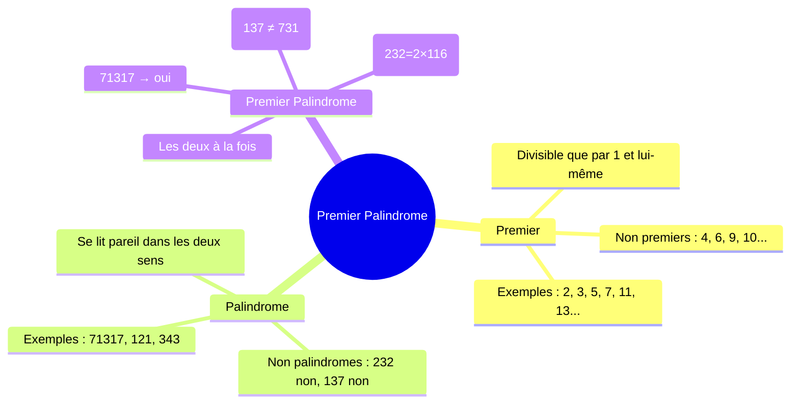
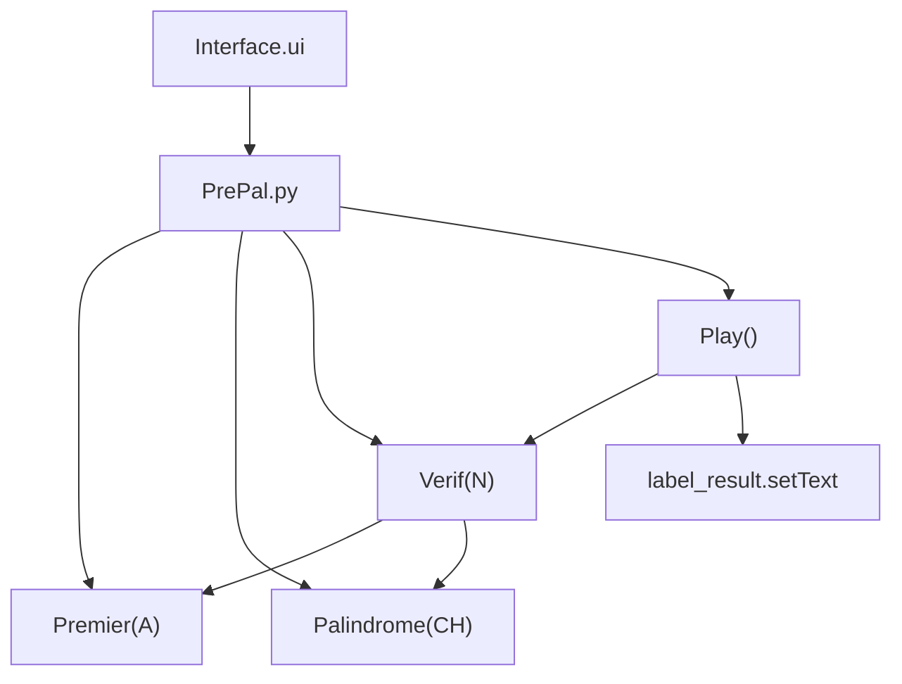
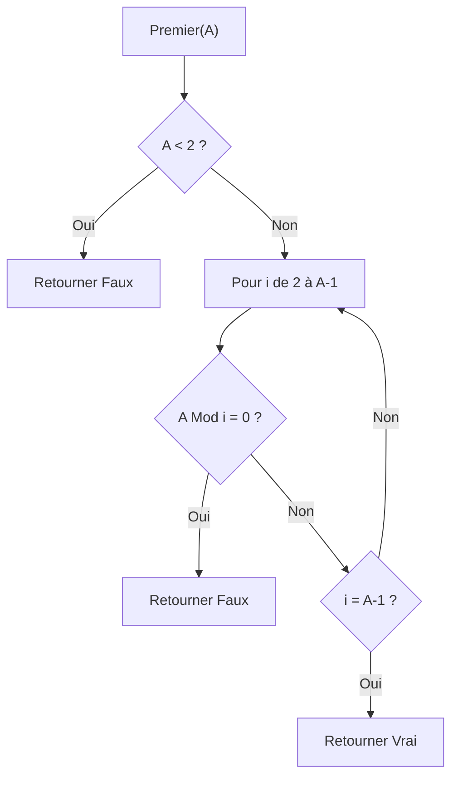
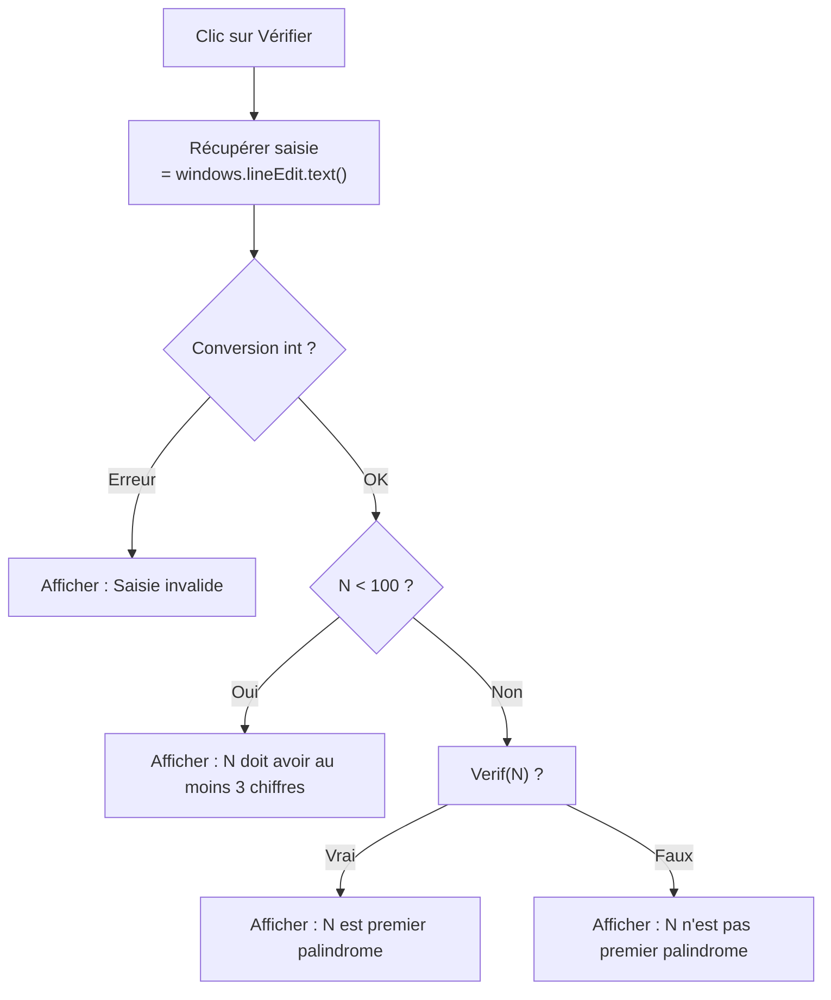

# BAC II — Premier Palindrome (Session 2025)
> Épreuve Pratique · PyQt5 · Durée : 1h · Coefficient : 0.5

---

## Concept central



---

## Architecture du programme



---

## 2a) Fonction Premier(A)

### Algorithme

```
Fonction Premier (A : Entier) : Booléen
Objet   Type/Nature
i       Entier

DEBUT
  Si A < 2 Alors
    Retourner Faux
  FinSi
  Pour i de 2 à A-1 Faire
    Si A Mod i = 0 Alors
      Retourner Faux
    FinSi
  Fin Pour
  Retourner Vrai
FIN
```

### Python

```python
def Premier(A):
    if A < 2:
        return False
    for i in range(2, A):
        if A % i == 0:
            return False
    return True
```

### Flowchart



### Tests rapides

| A | Premier ? | Raison |
|---|-----------|--------|
| 0 | Faux | < 2 |
| 1 | Faux | < 2 |
| 2 | Vrai | premier nombre premier |
| 4 | Faux | 4 = 2×2 |
| 7 | Vrai | non divisible par 2,3,4,5,6 |
| 71317 | Vrai | (nombre premier palindrome) |

---

## 2b) Fonction Palindrome(CH)

### Algorithme (donné dans le sujet)

```
Fonction Palindrome (CH : Chaîne de caractères) : Booléen
Objet   Type/Nature
i, j    Entier

DEBUT
  i ← 0
  j ← Long(CH) - 1
  Tant que (i < j) et (CH[i] = CH[j]) Faire
    i ← i + 1
    j ← j - 1
  Fin Tant que
  Retourner i ≥ j
FIN
```

### Python

```python
def Palindrome(CH):
    i = 0
    j = len(CH) - 1
    while (i < j) and (CH[i] == CH[j]):
        i += 1
        j -= 1
    return i >= j
```

### Trace pour CH = "71317"

| Étape | i | j | CH[i] | CH[j] | CH[i]=CH[j] |
|-------|---|---|-------|-------|-------------|
| 1     | 0 | 4 | "7"   | "7"   | ✓ → i=1, j=3 |
| 2     | 1 | 3 | "1"   | "1"   | ✓ → i=2, j=2 |
| 3     | 2 | 2 | —     | —     | i < j ? Non → Arrêt |

`i=2 ≥ j=2` → **Vrai** ✓

### Trace pour CH = "137"

| Étape | i | j | CH[i] | CH[j] | CH[i]=CH[j] |
|-------|---|---|-------|-------|-------------|
| 1     | 0 | 2 | "1"   | "7"   | ✗ → Arrêt |

`i=0 ≥ j=2` ? → **Faux** ✓

---

## 2c) Fonction Verif(N)

```python
def Verif(N):
    return Premier(N) and Palindrome(str(N))
```

> **Attention :** Il faut convertir N en chaîne avec `str(N)` avant d'appeler `Palindrome`.

---

## 2d) Module Play

```python
def Play():
    saisie = windows.lineEdit.text()
    try:
        N = int(saisie)
    except ValueError:
        windows.label_result.setText("Saisie invalide")
        return
    if N < 100:
        windows.label_result.setText("N doit avoir au moins 3 chiffres")
        return
    if Verif(N):
        windows.label_result.setText(f"{N} est premier palindrome")
    else:
        windows.label_result.setText(f"{N} n'est pas premier palindrome")
```



---

## 2e) Programme complet — PrePal.py

```python
from PyQt5.uic import loadUi
from PyQt5.QtWidgets import QApplication


def Premier(A):
    if A < 2:
        return False
    for i in range(2, A):
        if A % i == 0:
            return False
    return True


def Palindrome(CH):
    i = 0
    j = len(CH) - 1
    while (i < j) and (CH[i] == CH[j]):
        i += 1
        j -= 1
    return i >= j


def Verif(N):
    return Premier(N) and Palindrome(str(N))


def Play():
    saisie = windows.lineEdit.text()
    try:
        N = int(saisie)
    except ValueError:
        windows.label_result.setText("Saisie invalide")
        return
    if N < 100:
        windows.label_result.setText("N doit avoir au moins 3 chiffres")
        return
    if Verif(N):
        windows.label_result.setText(f"{N} est premier palindrome")
    else:
        windows.label_result.setText(f"{N} n'est pas premier palindrome")


app = QApplication([])
windows = loadUi("Interface.ui")
windows.show()
windows.btnVerifier.clicked.connect(Play)
app.exec_()
```

---

## Tests de validation

| N     | Premier ? | Palindrome ? | Résultat attendu |
|-------|-----------|--------------|-----------------|
| 71317 | Oui       | Oui          | `71317 est premier palindrome` |
| 232   | Non (2×116) | Oui        | `232 n'est pas premier palindrome` |
| 137   | Oui       | Non          | `137 n'est pas premier palindrome` |
| 2514  | Non       | Non          | `2514 n'est pas premier palindrome` |
| 11    | Oui       | Oui          | `11 est premier palindrome` |
| abc   | —         | —            | `Saisie invalide` |
| 99    | —         | —            | `N doit avoir au moins 3 chiffres` |

---

## Pièges à éviter

| Piège | Bonne pratique |
|-------|----------------|
| Oublier `str(N)` dans `Verif` | `Palindrome(str(N))` pas `Palindrome(N)` |
| Tester premiers : `range(2, A)` | Ne pas inclure A lui-même |
| `lineEdit.text()` retourne str | Toujours convertir avec `int()` |
| Vérifier N ≥ 3 chiffres | `N < 100` signifie moins de 3 chiffres |
| Oublier la gestion `ValueError` | Utiliser `try/except` |
