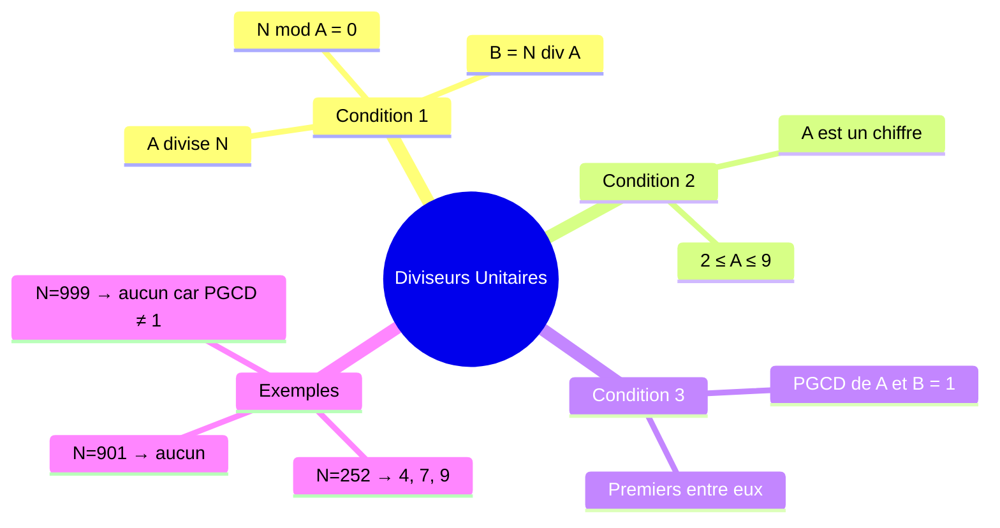
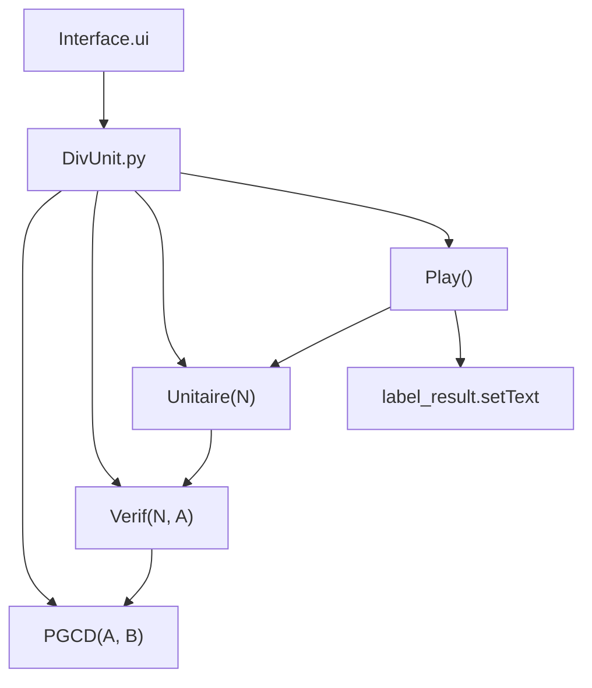
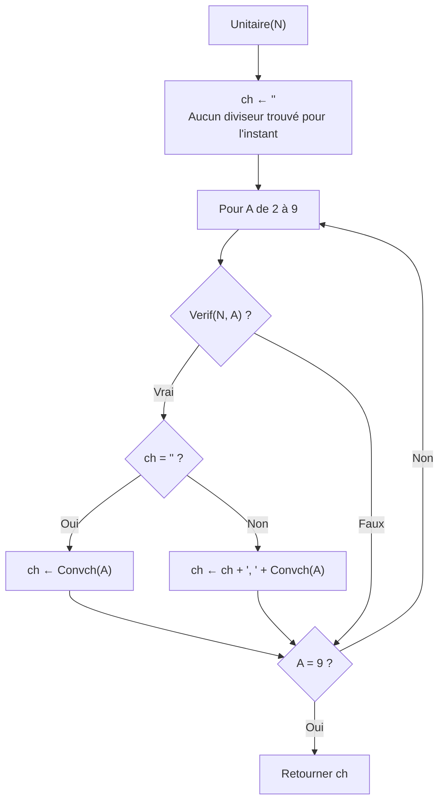
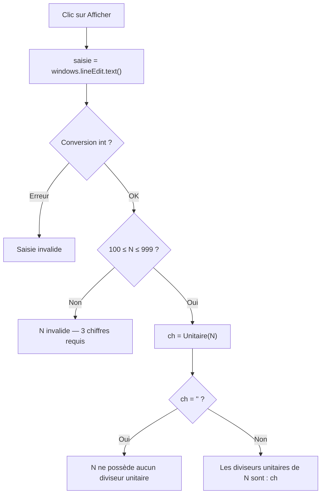

# BAC III — Diviseurs Unitaires (Session 2025)
> Épreuve Pratique · PyQt5 · Durée : 1h · Coefficient : 0.5

---

## Concept central

Un entier **A** est un **diviseur unitaire** de **N** si et seulement si :
1. `N = A × B` (A divise N)
2. A est composé d'**un seul chiffre différent de 1** → A ∈ {2, 3, 4, 5, 6, 7, 8, 9}
3. A et B sont **premiers entre eux** → `PGCD(A, B) = 1`



---

## Exemples vérifiés

### N = 252

| A | B = 252/A | Cond 1 | Cond 2 | PGCD(A,B) | Cond 3 | Diviseur unitaire ? |
|---|-----------|--------|--------|-----------|--------|---------------------|
| 2 | 126 | ✓ | ✓ | PGCD(2,126)=2 | ✗ | Non |
| 3 | 84 | ✓ | ✓ | PGCD(3,84)=3 | ✗ | Non |
| 4 | 63 | ✓ | ✓ | PGCD(4,63)=1 | ✓ | **Oui** |
| 5 | — | 252 mod 5 ≠ 0 | — | — | — | Non |
| 6 | 42 | ✓ | ✓ | PGCD(6,42)=6 | ✗ | Non |
| 7 | 36 | ✓ | ✓ | PGCD(7,36)=1 | ✓ | **Oui** |
| 8 | — | 252 mod 8 ≠ 0 | — | — | — | Non |
| 9 | 28 | ✓ | ✓ | PGCD(9,28)=1 | ✓ | **Oui** |

→ Diviseurs unitaires de 252 : **4, 7, 9** ✓

---

## Architecture du programme



---

## 2a) Fonction PGCD

### Algorithme (donné dans le sujet)

```
Fonction PGCD (A, B : Entier) : Entier
Objet   Type/Nature
R       Entier

DEBUT
  Tant que (B ≠ 0) Faire
    R ← A Mod B
    A ← B
    B ← R
  Fin Tant que
  Retourner A
FIN
```

### Python

```python
def PGCD(A, B):
    while B != 0:
        R = A % B
        A = B
        B = R
    return A
```

### Trace PGCD(4, 63)

| A  | B  | R = A Mod B | Nouveau A | Nouveau B |
|----|----|----|----|----|
| 4  | 63 | 4 Mod 63 = 4 | 63 | 4 |
| 63 | 4  | 63 Mod 4 = 3 | 4  | 3 |
| 4  | 3  | 4 Mod 3 = 1  | 3  | 1 |
| 3  | 1  | 3 Mod 1 = 0  | 1  | 0 |

B=0 → Retourner A=**1** ✓

---

## 2b) Fonction Verif(N, A)

```
Fonction Verif (N, A : Entier) : Booléen
Objet   Type/Nature
B       Entier

DEBUT
  B ← N Div A
  Retourner (N = A * B) et (A >= 2) et (A <= 9) et (PGCD(A, B) = 1)
FIN
```

```python
def Verif(N, A):
    B = N // A
    return (N == A * B) and (2 <= A <= 9) and (PGCD(A, B) == 1)
```

> **Note :** `N = A * B` est équivalent à `N mod A = 0`. Les deux formulations sont acceptées.

---

## 2c) Fonction Unitaire(N)



### Algorithme

```
Fonction Unitaire (N : Entier) : Chaîne de caractères
Objet   Type/Nature
A       Entier
ch      Chaîne de caractères

DEBUT
  ch ← ""
  Pour A de 2 à 9 Faire
    Si Verif(N, A) Alors
      Si ch = "" Alors
        ch ← Convch(A)
      Sinon
        ch ← ch + ", " + Convch(A)
      FinSi
    FinSi
  Fin Pour
  Retourner ch
FIN
```

### Python

```python
def Unitaire(N):
    ch = ""
    for A in range(2, 10):
        if Verif(N, A):
            if ch == "":
                ch = str(A)
            else:
                ch = ch + ", " + str(A)
    return ch
```

---

## 2d) Module Play

```python
def Play():
    saisie = windows.lineEdit.text()
    try:
        N = int(saisie)
    except ValueError:
        windows.label_result.setText("Saisie invalide")
        return
    if N < 100 or N > 999:
        windows.label_result.setText("N doit être un entier de 3 chiffres")
        return
    resultat = Unitaire(N)
    if resultat == "":
        windows.label_result.setText(f"{N} ne possède aucun diviseur unitaire")
    else:
        windows.label_result.setText(f"Les diviseurs unitaires de {N} sont : {resultat}")
```



---

## 2e) Programme complet — DivUnit.py

```python
from PyQt5.uic import loadUi
from PyQt5.QtWidgets import QApplication


def PGCD(A, B):
    while B != 0:
        R = A % B
        A = B
        B = R
    return A


def Verif(N, A):
    B = N // A
    return (N == A * B) and (2 <= A <= 9) and (PGCD(A, B) == 1)


def Unitaire(N):
    ch = ""
    for A in range(2, 10):
        if Verif(N, A):
            if ch == "":
                ch = str(A)
            else:
                ch = ch + ", " + str(A)
    return ch


def Play():
    saisie = windows.lineEdit.text()
    try:
        N = int(saisie)
    except ValueError:
        windows.label_result.setText("Saisie invalide")
        return
    if N < 100 or N > 999:
        windows.label_result.setText("N doit être un entier de 3 chiffres")
        return
    resultat = Unitaire(N)
    if resultat == "":
        windows.label_result.setText(f"{N} ne possède aucun diviseur unitaire")
    else:
        windows.label_result.setText(f"Les diviseurs unitaires de {N} sont : {resultat}")


app = QApplication([])
windows = loadUi("Interface.ui")
windows.show()
windows.btnAfficher.clicked.connect(Play)
app.exec_()
```

---

## Tests de validation

| N   | Attendu |
|-----|---------|
| 252 | `Les diviseurs unitaires de 252 sont : 4, 7, 9` |
| 901 | `901 ne possède aucun diviseur unitaire` |
| 999 | `999 ne possède aucun diviseur unitaire` |
| 500 | `Les diviseurs unitaires de 500 sont : 4` *(500=4×125, PGCD(4,125)=1)* |
| abc | `Saisie invalide` |
| 50  | `N doit être un entier de 3 chiffres` |

---

## Pièges à éviter

| Piège | Bonne pratique |
|-------|----------------|
| Tester A de 1 à 9 | Exclure 1 : A va de **2** à **9** |
| Oublier la condition PGCD=1 | Les 3 conditions sont cumulatives (et) |
| Diviser avant de vérifier divisibilité | `B = N // A` puis vérifier `N == A * B` |
| Retourner liste Python au lieu de chaîne | Construire une chaîne avec `, ` entre les valeurs |
| N de 3 chiffres → 100 à 999 | `N < 100 or N > 999` pour invalider |
