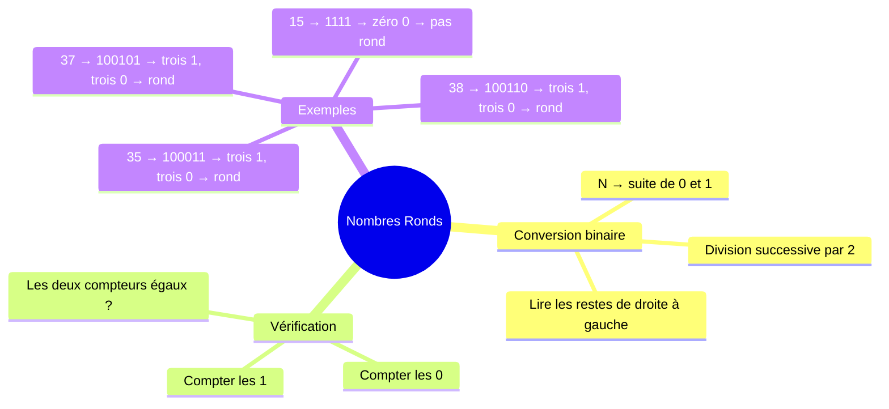
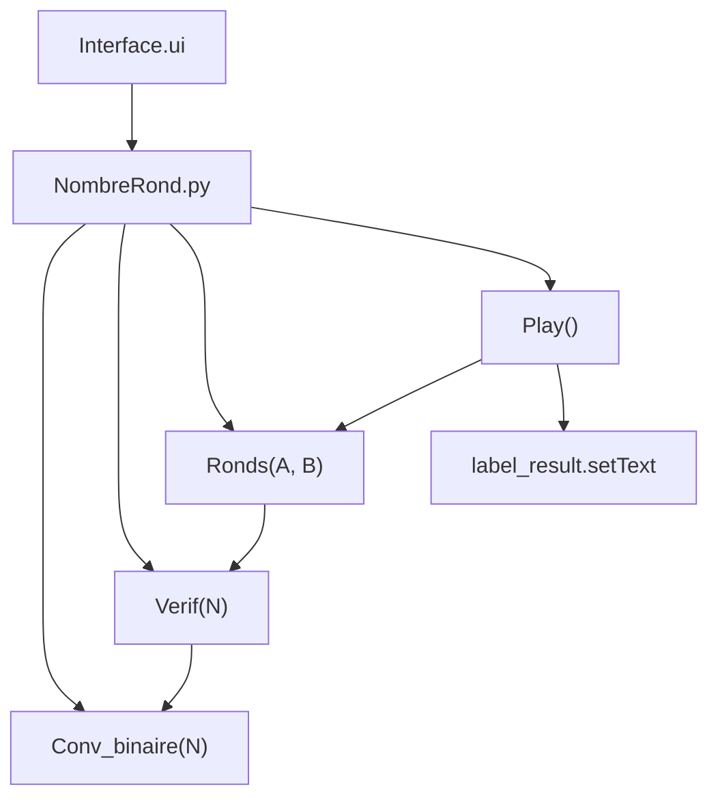
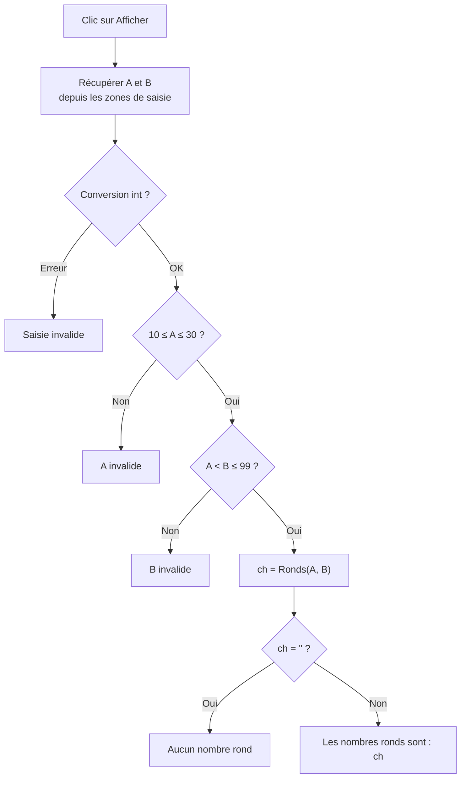

# BAC IV — Nombres Ronds (Session 2025)
> Épreuve Pratique · PyQt5 · Durée : 1h · Coefficient : 0.5

---

## Concept central

Un nombre est dit **rond** si sa représentation binaire contient **autant de 0 que de 1**.



---

## Exemples vérifiés

| Nombre | Binaire | Nb de 1 | Nb de 0 | Rond ? |
|--------|---------|---------|---------|--------|
| 35 | 100011 | 3 | 3 | **Oui** |
| 37 | 100101 | 3 | 3 | **Oui** |
| 38 | 100110 | 3 | 3 | **Oui** |
| 36 | 100100 | 2 | 4 | Non |
| 15 | 1111   | 4 | 0 | Non |
| 20 | 10100  | 2 | 3 | Non |

---

## Trace Conv_binaire(35)

`N=35`, division successive par 2 :

| N  | r = N Mod 2 | N ← N Div 2 | ch = Convch(r) + ch |
|----|-------------|-------------|----------------------|
| 35 | 1           | 17          | "1" + "" = "1" |
| 17 | 1           | 8           | "1" + "1" = "11" |
| 8  | 0           | 4           | "0" + "11" = "011" |
| 4  | 0           | 2           | "0" + "011" = "0011" |
| 2  | 0           | 1           | "0" + "0011" = "00011" |
| 1  | 1           | 0           | "1" + "00011" = "100011" |

N=0 → Arrêt. Résultat : **"100011"** ✓

---

## Architecture du programme



---

## 2a) Fonction Conv_binaire

### Algorithme (donné dans le sujet)

```
Fonction Conv_binaire (N : Entier) : Chaîne de caractères
Objet   Type/Nature
ch      Chaîne de caractères
r       Entier

DEBUT
  Si N = 0 Alors
    Retourner "0"
  FinSi
  ch ← ""
  Tant que N ≠ 0 Faire
    r ← N Mod 2
    N ← N Div 2
    ch ← Convch(r) + ch
  Fin Tant que
  Retourner ch
FIN
```

### Python

```python
def Conv_binaire(N):
    if N == 0:
        return "0"
    ch = ""
    while N != 0:
        r = N % 2
        N = N // 2
        ch = str(r) + ch
    return ch
```

### Flowchart

```mermaid
flowchart TD
    A["Conv_binaire(N)"] --> B{N = 0 ?}
    B -- Oui --> C[Retourner "0"]
    B -- Non --> D["ch ← ''"]
    D --> E{N ≠ 0 ?}
    E -- Oui --> F["r ← N Mod 2\nN ← N Div 2\nch ← Convch(r) + ch"]
    F --> E
    E -- Non --> G[Retourner ch]
```

> **Point clé :** `ch = str(r) + ch` place le nouveau bit **à gauche** — c'est ce qui construit le binaire dans le bon ordre.

---

## 2b) Fonction Verif(N)

```
Fonction Verif (N : Entier) : Booléen
Objet   Type/Nature
ch      Chaîne de caractères
nb0     Entier
nb1     Entier
i       Entier

DEBUT
  ch ← Conv_binaire(N)
  nb0 ← 0
  nb1 ← 0
  Pour i de 0 à Long(ch)-1 Faire
    Si ch[i] = "0" Alors
      nb0 ← nb0 + 1
    Sinon
      nb1 ← nb1 + 1
    FinSi
  Fin Pour
  Retourner nb0 = nb1
FIN
```

```python
def Verif(N):
    ch = Conv_binaire(N)
    return ch.count('0') == ch.count('1')
```

> **Raccourci Python :** `str.count()` compte les occurrences d'un caractère. Équivalent mais plus concis que la boucle algorithmique.

---

## 2c) Fonction Ronds(A, B)

```
Fonction Ronds (A, B : Entier) : Chaîne de caractères
Objet   Type/Nature
ch      Chaîne de caractères
n       Entier

DEBUT
  ch ← ""
  Pour n de A à B Faire
    Si Verif(n) Alors
      Si ch = "" Alors
        ch ← Convch(n)
      Sinon
        ch ← ch + "-" + Convch(n)
      FinSi
    FinSi
  Fin Pour
  Retourner ch
FIN
```

```python
def Ronds(A, B):
    ch = ""
    for n in range(A, B + 1):
        if Verif(n):
            if ch == "":
                ch = str(n)
            else:
                ch = ch + "-" + str(n)
    return ch
```

### Trace pour A=20, B=40

Résultats intermédiaires :

| n | Binaire | Nb0 | Nb1 | Rond ? |
|---|---------|-----|-----|--------|
| 20 | 10100 | 3 | 2 | Non |
| 21 | 10101 | 2 | 3 | Non |
| 35 | 100011 | 3 | 3 | **Oui** → ch="35" |
| 37 | 100101 | 3 | 3 | **Oui** → ch="35-37" |
| 38 | 100110 | 3 | 3 | **Oui** → ch="35-37-38" |
| 39 | 100111 | 2 | 4 | Non |
| 40 | 101000 | 4 | 2 | Non |

Résultat : `"35-37-38"` ✓

---

## 2d) Module Play

```python
def Play():
    try:
        A = int(windows.lineEdit_A.text())
        B = int(windows.lineEdit_B.text())
    except ValueError:
        windows.label_result.setText("Saisie invalide")
        return
    if not (10 <= A <= 30):
        windows.label_result.setText("A invalide : 10 ≤ A ≤ 30")
        return
    if not (A < B <= 99):
        windows.label_result.setText("B invalide : A < B ≤ 99")
        return
    resultat = Ronds(A, B)
    if resultat == "":
        windows.label_result.setText("Aucun nombre rond")
    else:
        windows.label_result.setText(f"Les nombres ronds sont : {resultat}")
```



---

## 2e) Programme complet — NombreRond.py

```python
from PyQt5.uic import loadUi
from PyQt5.QtWidgets import QApplication


def Conv_binaire(N):
    if N == 0:
        return "0"
    ch = ""
    while N != 0:
        r = N % 2
        N = N // 2
        ch = str(r) + ch
    return ch


def Verif(N):
    ch = Conv_binaire(N)
    return ch.count('0') == ch.count('1')


def Ronds(A, B):
    ch = ""
    for n in range(A, B + 1):
        if Verif(n):
            if ch == "":
                ch = str(n)
            else:
                ch = ch + "-" + str(n)
    return ch


def Play():
    try:
        A = int(windows.lineEdit_A.text())
        B = int(windows.lineEdit_B.text())
    except ValueError:
        windows.label_result.setText("Saisie invalide")
        return
    if not (10 <= A <= 30):
        windows.label_result.setText("A invalide : 10 ≤ A ≤ 30")
        return
    if not (A < B <= 99):
        windows.label_result.setText("B invalide : A < B ≤ 99")
        return
    resultat = Ronds(A, B)
    if resultat == "":
        windows.label_result.setText("Aucun nombre rond")
    else:
        windows.label_result.setText(f"Les nombres ronds sont : {resultat}")


app = QApplication([])
windows = loadUi("Interface.ui")
windows.show()
windows.btnAfficher.clicked.connect(Play)
app.exec_()
```

---

## Tests de validation

| A  | B  | Attendu |
|----|----|---------|
| 20 | 40 | `Les nombres ronds sont : 35-37-38` |
| 15 | 30 | `Aucun nombre rond` |
| 10 | 99 | `Les nombres ronds sont : 27-30-39-45-51-54-57-78-...` *(liste complète)* |
| abc | — | `Saisie invalide` |
| 5  | 50 | `A invalide : 10 ≤ A ≤ 30` |
| 20 | 100 | `B invalide : A < B ≤ 99` |
| 25 | 20 | `B invalide : A < B ≤ 99` |

---

## Pièges à éviter

| Piège | Bonne pratique |
|-------|----------------|
| Oublier le cas `N=0` dans Conv_binaire | `if N == 0: return "0"` avant la boucle |
| Mettre `ch = str(r) + ch` dans le mauvais sens | Le bit va **à gauche** : `str(r) + ch` |
| Séparateur "-" vs "," | Le sujet demande **"-"** (tiret) |
| Deux zones de saisie distinctes pour A et B | Noms différents : `lineEdit_A` et `lineEdit_B` |
| Valider A puis B séparément | D'abord A, puis B (B dépend de A : `A < B`) |
| `ch.count('0') == ch.count('1')` | Méthode Python correcte pour compter les 0 et 1 |
| N=0 est-il rond ? | "0" → 1 zéro, 0 uns → **pas rond** |
