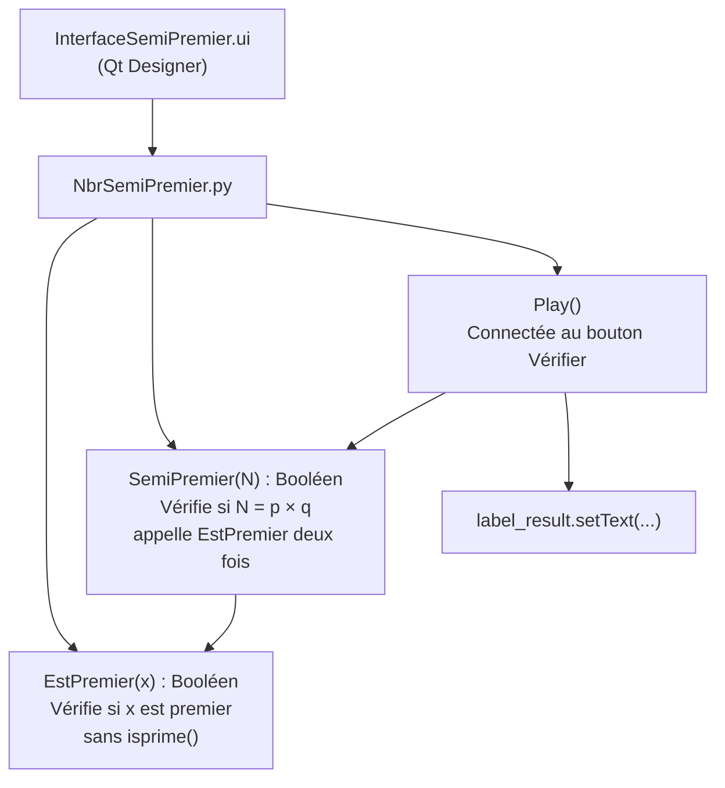
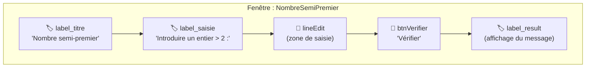
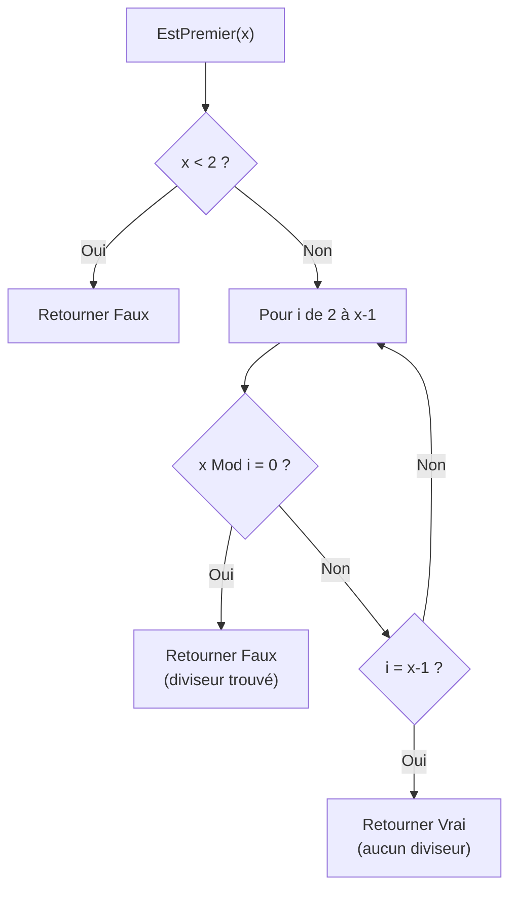
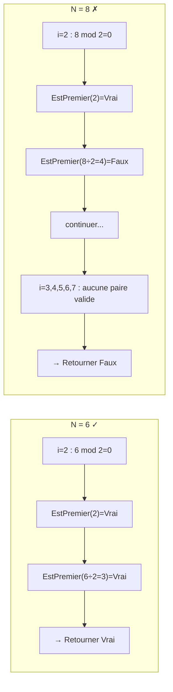
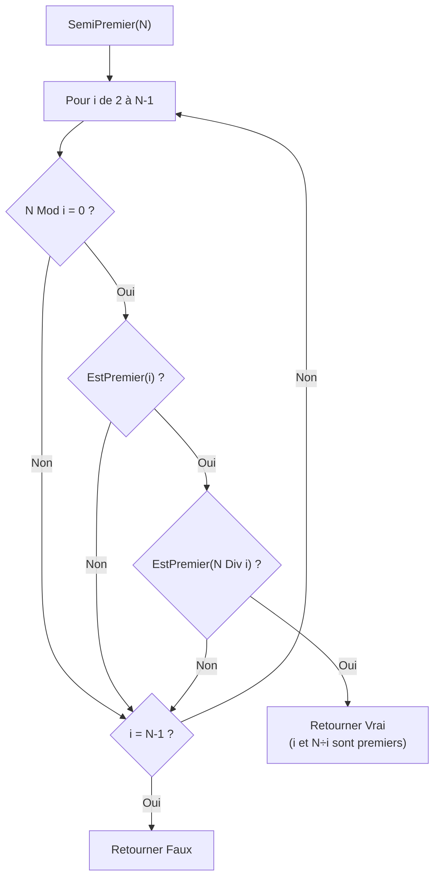
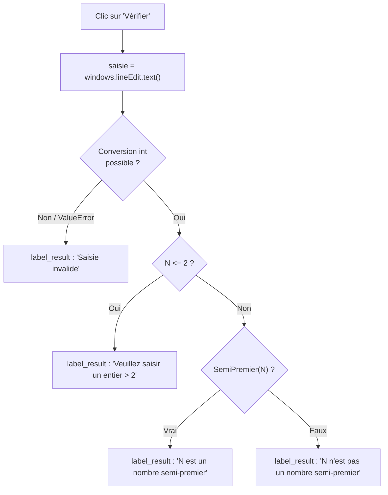

# BAC Pratique 2022 — Nombre Semi-Premier
> Épreuve Pratique · PyQt5 · Sections : Math, Sciences Exp., Sciences Tech. · Durée : 1h · Coefficient : 0.5

---

## Concept central — Mind Map

```mermaid
mindmap
  root((Nombre Semi-Premier))
    Définition
      N = p × q
      p et q sont tous les deux premiers
      Pas nécessairement distincts p = q autorisé
    Exemples valides ✓
      6 = 2 × 3
      25 = 5 × 5
      831 = 3 × 277
    Contre-exemples ✗
      8 = 2 × 4 car 4 non premier
      12 = 2 × 6 car 6 non premier
    Stratégie algorithmique
      Parcourir diviseurs i de 2 à N-1
      Si i divise N
        EstPremier(i) ET EstPremier(N div i)
        → Retourner Vrai
      Fin boucle → Retourner Faux
    Modules à créer
      EstPremier(x)
      SemiPremier(N)
      Play()
```

---

## Architecture du programme



---

## Cheat Sheet — Vue d'ensemble

| Fonction | Paramètre | Retour | Rôle |
|----------|-----------|--------|------|
| `EstPremier(x)` | Entier x | Booléen | x est-il premier ? (interdit : isprime) |
| `SemiPremier(N)` | Entier N > 2 | Booléen | N = p × q avec p, q premiers ? |
| `Play()` | — | Affichage | Récupère saisie → vérifie → affiche résultat |

| Élément Qt | Type | Nom suggéré |
|------------|------|-------------|
| Titre | QLabel | `label_titre` |
| Instruction | QLabel | `label_saisie` |
| Saisie | QLineEdit | `lineEdit` |
| Bouton | QPushButton | `btnVerifier` |
| Résultat | QLabel | `label_result` |

---

## 1) Interface — InterfaceSemiPremier

### Structure visuelle



### Éléments de l'interface (Qt Designer)

| # | Élément | Type Qt | `objectName` | Texte |
|---|---------|---------|--------------|-------|
| 1 | Titre | `QLabel` | `label_titre` | `Nombre semi-premier` |
| 2 | Instruction | `QLabel` | `label_saisie` | `Introduire un entier > 2 :` |
| 3 | Saisie | `QLineEdit` | `lineEdit` | *(vide)* |
| 4 | Bouton | `QPushButton` | `btnVerifier` | `Vérifier` |
| 5 | Résultat | `QLabel` | `label_result` | *(vide)* |

> **Rappel Qt Designer :** Enregistrer le fichier sous `InterfaceSemiPremier.ui` dans votre dossier de travail.

---

## 2) Fonction EstPremier(x)

> ⚠️ Le sujet **interdit** `isprime()` — la primalité doit être vérifiée manuellement.

### Algorithme (Convention 2022-2023)

```
Fonction EstPremier (x : Entier) : Booléen
Objet   Type/Nature
i       Entier

DEBUT
  Si x < 2 Alors
    Retourner Faux
  FinSi
  Pour i de 2 à x-1 Faire
    Si x Mod i = 0 Alors
      Retourner Faux
    FinSi
  Fin Pour
  Retourner Vrai
FIN
```

### Python

```python
def EstPremier(x):
    if x < 2:
        return False
    for i in range(2, x):
        if x % i == 0:
            return False
    return True
```

### Flowchart EstPremier



### Table de vérité rapide

| x | EstPremier ? | Raison |
|---|--------------|--------|
| 0 | Faux | < 2 |
| 1 | Faux | < 2 |
| 2 | Vrai | aucun i entre 2 et 1 → boucle vide |
| 3 | Vrai | non divisible par 2 |
| 4 | Faux | 4 Mod 2 = 0 |
| 5 | Vrai | non divisible par 2, 3, 4 |
| 277 | Vrai | nombre premier |

---

## 3) Fonction SemiPremier(N)

### Principe (flowchart par exemple)



### Algorithme (Convention 2022-2023)

```
Fonction SemiPremier (N : Entier) : Booléen
Objet   Type/Nature
i       Entier

DEBUT
  Pour i de 2 à N-1 Faire
    Si (N Mod i = 0) ET EstPremier(i) ET EstPremier(N Div i) Alors
      Retourner Vrai
    FinSi
  Fin Pour
  Retourner Faux
FIN
```

### Python

```python
def SemiPremier(N):
    for i in range(2, N):
        if N % i == 0 and EstPremier(i) and EstPremier(N // i):
            return True
    return False
```

### Flowchart SemiPremier



### Trace détaillée pour N = 831

| i | 831 Mod i | i divise 831 ? | EstPremier(i) | 831 Div i | EstPremier(277) | Décision |
|---|-----------|----------------|---------------|-----------|-----------------|----------|
| 2 | 1 | Non | — | — | — | continuer |
| 3 | 0 | **Oui** | **Vrai** | 277 | **Vrai** | **→ Vrai ✓** |

### Trace détaillée pour N = 8

| i | 8 Mod i | i divise 8 ? | EstPremier(i) | 8 Div i | EstPremier(quotient) | Décision |
|---|---------|--------------|---------------|---------|----------------------|----------|
| 2 | 0 | Oui | Vrai | 4 | **Faux** (4=2×2) | continuer |
| 3 | 2 | Non | — | — | — | continuer |
| 4 | 0 | Oui | **Faux** | — | — | continuer |
| 5 | 3 | Non | — | — | — | continuer |
| 6 | 2 | Non | — | — | — | continuer |
| 7 | 1 | Non | — | — | — | continuer |
→ **Retourner Faux ✓**

---

## 4) Module Play

### Algorithme

```
Module Play ()
Objet     Type/Nature
saisie    Chaîne de caractères
N         Entier

DEBUT
  saisie ← windows.lineEdit.text()
  Si EstNum(saisie) Alors
    N ← Valeur(saisie)
    Si N <= 2 Alors
      windows.label_result.setText("Veuillez saisir un entier > 2")
    Sinon
      Si SemiPremier(N) Alors
        windows.label_result.setText(Convch(N) + " est un nombre semi-premier")
      Sinon
        windows.label_result.setText(Convch(N) + " n'est pas un nombre semi-premier")
      FinSi
    FinSi
  Sinon
    windows.label_result.setText("Saisie invalide")
  FinSi
FIN
```

### Flowchart Play



### Python

```python
def Play():
    saisie = windows.lineEdit.text()
    try:
        N = int(saisie)
    except ValueError:
        windows.label_result.setText("Saisie invalide")
        return
    if N <= 2:
        windows.label_result.setText("Veuillez saisir un entier > 2")
        return
    if SemiPremier(N):
        windows.label_result.setText(f"{N} est un nombre semi-premier")
    else:
        windows.label_result.setText(f"{N} n'est pas un nombre semi-premier")
```

---

## 5) Programme complet — NbrSemiPremier.py

```python
from PyQt5.uic import loadUi
from PyQt5.QtWidgets import QApplication


def EstPremier(x):
    if x < 2:
        return False
    for i in range(2, x):
        if x % i == 0:
            return False
    return True


def SemiPremier(N):
    for i in range(2, N):
        if N % i == 0 and EstPremier(i) and EstPremier(N // i):
            return True
    return False


def Play():
    saisie = windows.lineEdit.text()
    try:
        N = int(saisie)
    except ValueError:
        windows.label_result.setText("Saisie invalide")
        return
    if N <= 2:
        windows.label_result.setText("Veuillez saisir un entier > 2")
        return
    if SemiPremier(N):
        windows.label_result.setText(f"{N} est un nombre semi-premier")
    else:
        windows.label_result.setText(f"{N} n'est pas un nombre semi-premier")


app = QApplication([])
windows = loadUi("InterfaceSemiPremier.ui")
windows.show()
windows.btnVerifier.clicked.connect(Play)
app.exec_()
```

---

## Tests de validation complets

| N | Semi-premier ? | Décomposition | Message affiché |
|---|----------------|---------------|-----------------|
| 6 | **Oui** | 2 × 3 | `6 est un nombre semi-premier` |
| 25 | **Oui** | 5 × 5 | `25 est un nombre semi-premier` |
| 831 | **Oui** | 3 × 277 | `831 est un nombre semi-premier` |
| 8 | **Non** | 2 × 4 (4 non premier) | `8 n'est pas un nombre semi-premier` |
| 4 | **Oui** | 2 × 2 | `4 est un nombre semi-premier` |
| 15 | **Oui** | 3 × 5 | `15 est un nombre semi-premier` |
| 12 | **Non** | 2×6 ou 3×4 (6 et 4 non premiers) | `12 n'est pas un nombre semi-premier` |
| 9 | **Oui** | 3 × 3 | `9 est un nombre semi-premier` |
| `abc` | — | — | `Saisie invalide` |
| 1 | — | ≤ 2 | `Veuillez saisir un entier > 2` |

---

## Grille d'évaluation annotée

| Tâche | Points | Points clés pour obtenir la note |
|-------|--------|----------------------------------|
| Interface `InterfaceSemiPremier` | **4 pts** | 5 éléments présents + noms corrects + enregistrement `.ui` |
| Création fichier `NbrSemiPremier` | **1 pt** | Fichier `.py` enregistré avec le bon nom dans le dossier |
| Fonction `SemiPremier(N)` | **6 pts** | Boucle i de 2 à N-1 + condition double `EstPremier` + `Retourner Faux` en fin |
| Appel de l'interface | **2 pts** | `loadUi("InterfaceSemiPremier.ui")` + `windows.show()` |
| Module `Play` | **4 pts** | Récupération `lineEdit.text()` + conversion + appel `SemiPremier` + affichage `label_result` |
| Imports + modularité + cohérence | **3 pts** | `from PyQt5.uic import loadUi` + `from PyQt5.QtWidgets import QApplication` + fonctions séparées |
| **TOTAL** | **20 pts** | |

---

## Pièges à éviter — Récapitulatif

```mermaid
mindmap
  root((Pièges BAC Semi-Premier))
    EstPremier
      Interdit isprime()
      Coder la boucle manuellement
      Gérer x < 2 en premier
    SemiPremier
      Vérifier LES DEUX facteurs
      N Mod i = 0 ET EstPremier(i) ET EstPremier(N Div i)
      Ne pas oublier Retourner Faux après la boucle
    Play
      lineEdit.text() retourne une chaîne
      Toujours convertir avec int()
      Gérer ValueError avec try/except
      Vérifier N > 2 avant tout
    Interface
      5 éléments obligatoires
      Utiliser le bon objectName pour chaque widget
      Fichier .ui dans le dossier de travail
```

| Piège fréquent | Bonne pratique |
|----------------|----------------|
| Utiliser `isprime()` (interdit par le sujet) | Coder `EstPremier` manuellement avec `Pour i de 2 à x-1` |
| Vérifier un seul facteur (`EstPremier(i)` seulement) | Vérifier **les deux** : `EstPremier(i)` **ET** `EstPremier(N Div i)` |
| Division normale `/` au lieu de division entière | Utiliser `N // i` en Python, `N Div i` en algorithmique |
| Ne pas gérer N ≤ 2 dans `Play` | Le sujet précise **N > 2** — valider avant d'appeler `SemiPremier` |
| Oublier `try/except ValueError` dans `Play` | `lineEdit.text()` renvoie une **chaîne** — toujours convertir avec `int()` |
| Afficher le résultat dans le mauvais label | Utiliser `label_result`, **pas** `label_saisie` |
| Oublier `Retourner Faux` à la fin de `SemiPremier` | La boucle épuisée sans résultat → `Retourner Faux` obligatoire |
| Ne pas connecter le bouton | `windows.btnVerifier.clicked.connect(Play)` — ligne critique |
